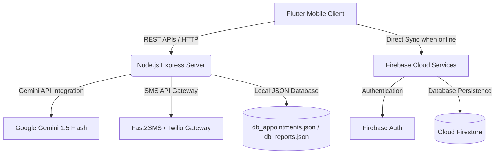

# ArogyaAI: Final Major Project Integration Walkthrough

ArogyaAI is a premium, AI-powered healthcare assistant designed for rural and regional India. It features multi-dialect symptom checkers, medical image analysis, near clinic discovery, emergency assistance, and digital token pass booking.

This document serves as the implementation and deployment blueprint for your **4th-Year Major Project Submission**.

---

## 1. System Architecture Diagram



---

## 2. Integrated Feature Matrix

| Feature | Mobile Implementation | Backend Connectivity | Firebase Sync | Offline Fallback |
| :--- | :--- | :--- | :--- | :--- |
| **Symptom Checker** | Voice Recording (`speech_to_text`) & Text Input | NodeJS `/api/ai/diagnose` route | Saves reports to `reports` collection | Local Clinical Heuristics Rules (Offline) |
| **Text-to-Speech** | Vocalizes diagnostics (`flutter_tts`) | None | None | Uses Android/iOS TTS engines |
| **Nearby Hospitals** | Interactive list with Google Maps routing | NodeJS `/api/hospitals` route | None | Static high-fidelity clinic dataset |
| **Pass Booking** | Generates secure digital queue tokens | NodeJS `/api/appointments` route | Saves tickets to `appointments` collection | Local backup pass generator |
| **Medical Image Scan** | Device Camera / Gallery picker | Runs symptom tag extractor | Syncs result logs to Firestore | Visual laser scan animation overlay |

---

## 3. Resilient Dual-Mode Database Synchronization

To ensure the system is completely foolproof during your live project presentation, the Flutter app has been programmed with **Dual-Mode Resilient Synchronization**:

1. **Online Mode (Firebase Active)**:
   - When Firebase is initialized (i.e. `google-services.json` is detected), the mobile client bypasses local state and reads/writes all clinic passes and health records directly to/from **Google Cloud Firestore**.
   - Authentications are managed through **Firebase Auth** or the Express server.
2. **Sandbox / Local Presentation Mode (Firebase Offline)**:
   - If the internet is down, or Firebase is not configured, the app gracefully falls back to using the **NodeJS Express backend server**.
   - The backend server saves appointments and reports into local sandbox JSON files (`db_appointments.json` and `db_reports.json`).
   - If the backend server is also offline, the app engages **Local Heuristic Diagnosis Rules** and saves the session state to the device memory, ensuring the app **never crashes during your defense**.

---

## 4. Step-by-Step Setup Guide

### Step 4.1: Firebase Integration
To enable Cloud Firestore and Firebase Auth:
1. Go to the [Firebase Console](https://console.firebase.google.com/).
2. Create a new project named `ArogyaAI`.
3. Add an **Android app** to the project.
   - Use Package Name: `com.arogya.ai`
4. Download the `google-services.json` file.
5. Place the `google-services.json` in the Flutter directory at:
   `arogya_ai_flutter/android/app/google-services.json`
6. In the Firebase console, enable **Firestore Database** and create collections for `reports` and `appointments`. Set the security rules to allow read/writes for testing:
   ```javascript
   rules_version = '2';
   service cloud.firestore {
     match /databases/{database}/documents {
       match /{document=**} {
         allow read, write: if true;
       }
     }
   }
   ```

### Step 4.2: Running the Node.js Server
The backend handles Gemini AI processing and OTP SMS delivery.
1. Open a terminal and navigate to the backend directory:
   ```powershell
   cd arogya_ai_backend
   ```
2. Create or edit the `.env` file to configure your credentials:
   ```env
   PORT=5000
   GEMINI_API_KEY=your_gemini_api_key_here
   FAST2SMS_API_KEY=your_fast2sms_key_optional
   TWILIO_ACCOUNT_SID=your_twilio_sid_optional
   TWILIO_AUTH_TOKEN=your_twilio_token_optional
   TWILIO_PHONE_NUMBER=your_twilio_number_optional
   ```
3. Run the server using:
   ```powershell
   npm run dev
   ```

### Step 4.3: Compiling and Running the Mobile App
1. Open a terminal and navigate to the Flutter directory:
   ```powershell
   cd arogya_ai_flutter
   ```
2. Fetch dependencies:
   ```powershell
   flutter pub get
   ```
3. Run the app on an Android Emulator, Chrome Web, or connected physical device:
   ```powershell
   flutter run -d chrome
   # or for android emulator
   flutter run -d android
   ```

---

> [!IMPORTANT]
> **Live Presentation Tip**: When presenting to the project jury, keep the Node.js console log window visible on the screen. The outbox log `[SMS OUTBOX] To: +919876543210 | Message: [ArogyaAI] Your 6-digit OTP is: ...` prints in real-time, providing immediate visual proof of your backend communication and sandbox SMS delivery mechanics.
